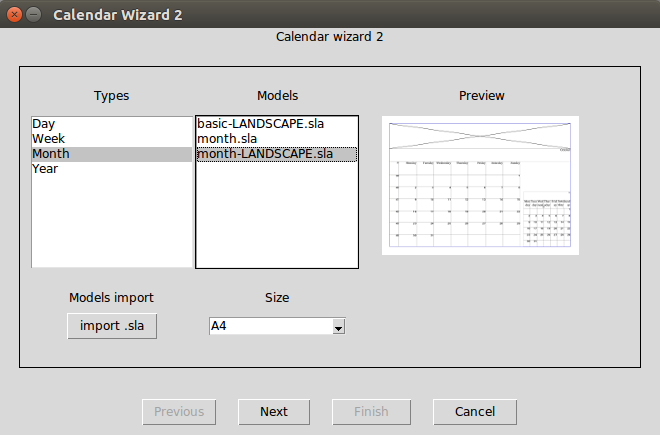
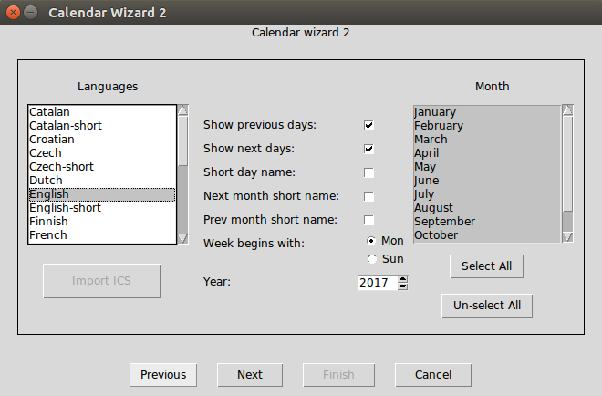
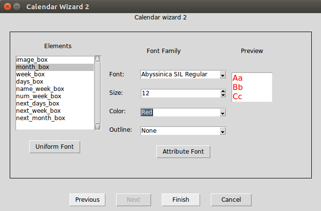
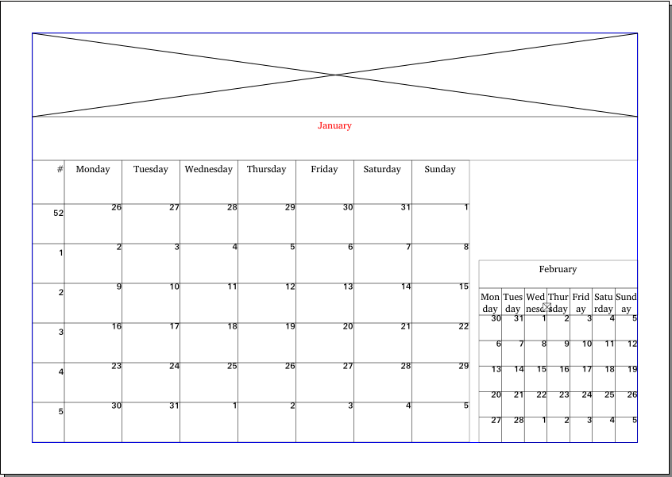

# Calendar Wizard 2

This script is not hard to use. You have got some initial model, and you can perform your own model.

## Getting Started

### Linux install

* Manual :
```
cp ./CalendarWizard2.py /your/scribus/location/of/scripts
mkdir /your/scribus/location/of/scripts/img
cp ./croix.png /your/scribus/location/of/scripts/img
cp -R ./format/ /your/scribus/location/of/scripts
cp -R ./models/ /your/scribus/location/of/scripts
```
##### Dependencies : 
* ```sudo apt-get install python-lxml```
* ```sudo apt-get install python-tk python-imaging-tk python3-tk```

### Windows

Copy files and directory : CalendarWizard2.py, croix.png, format, models into /scripts in your PATH installation.


## Description

This is an advanced 'Calendar creation wizard' for Scribus. It's inspired from CalendarWizard.py. Thanks to Petr Vanek.

In page 1 : Select the type and choose the right model as your wishes. Then you have got the preview as the model pre-selected, then press next.
You can if you have it, a new model by pressing the button "Import model".



In page 2 : You can choose the language and the different month, which will be implements to your calendar, this is pretty the same look as Calendar Wizard 2.
But you can also choose if you want the number of the week, if you want the right full name of the day, and if you wanna show the days before and after the current month.
You can also import an ICS file to match with special days. (Unfortunatly this utility does'nt work yet !)



In page 3 : It integrate all elements that can be found in the model choosen by the users.
You can change Font, style, size and color.



## Example



## Usage
This script needs a model as scribus file because it will parse your model.
It will create a GUI with available options
for easy calendar page creation. You'll get new pages with calendar
tables into a new document based on the model you asked for. Position of the
objects in page is calculated with the original box in the model.

Steps to create calendar:
* Choose an existing model or import a new one
* Fill requested values in the second and third page of the Calendar dialogue
* Press Finnish and the new document is auto generated from the model.

There are 4 types of calender supported yet:
* Year calendar with all months matrix on one page.
* Month calendar with one month matrix per page.
* Week calendar with only the week matrix per page.
* Day calendar which represent one day with hours per page.

Steps to create model:
* Create new scribus document, with right size, marge and orientation that you want.
* Draw textBox in your model which regroup elements
* Rename textBox in the property
    * /!\ Beware, the names of boxes are very important, this script recognize all these explicit keyword :

				month_box 		= Necessary, contains the string of the current month.
				week_box 		= Necessary, contains the string of each days of the week.
				days_box 		= Necessary, contains all the days number box
				image_box 		= Optional, used for image.
				num_week_box 		= Optional, contains the number of the week
				name_week_box 		= Optional, contains the string of the "num_week_box"

				next_month_box		= Optional
				next_image_box		= Optional
				next_week_box		= Necessary if next_month_box
				next_days_box		= Necessary if next_month_box
				next_num_week_box	= Optional
				next_name_week_box	= Optional

				prev_month_box		= Optional
				prev_image_box		= Optional
				prev_week_box		= Necessary if prev_month_box
				prev_days_box		= Necessary if prev_month_box
				prev_num_week_box	= Optional
				next_name_week_box	= Optional


				- For year model, as the image, add number to the end of string from 1.
				- In case of many images, add number to the end of string from 1.
				
* Go to "File" / "Document Setup" / "Information about the document" / label "KEYWORD" and then add the type of your calendar :
```type='TheType'```

		"TheType" can be "Day" / "Week" / "Month" / "Year", but it can be "Month,Week", etc.

* And then add all the element name in your model :

```element='name_of_boxes,name_of_boxes2,name_of_boxes3'```

    exemple :
		type='Month'
		element='month_box,week_box,days_box,image_box,next_month_box,next_week_box,next_days_box'

## Authors

* Vincent Le Jeune - *vincent.ljeune@gmail.com*

See also the list of *contributors* who participated in this project.


Everything is not perfect at the moment, but I'm still working on it ! 

And I hope you will too :)
